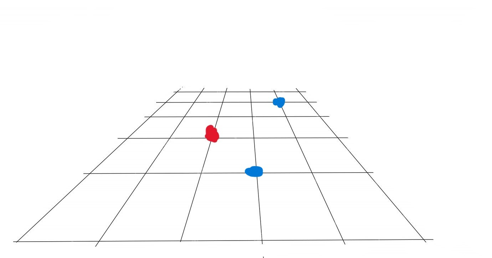
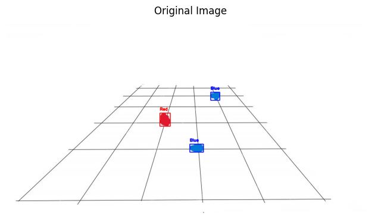
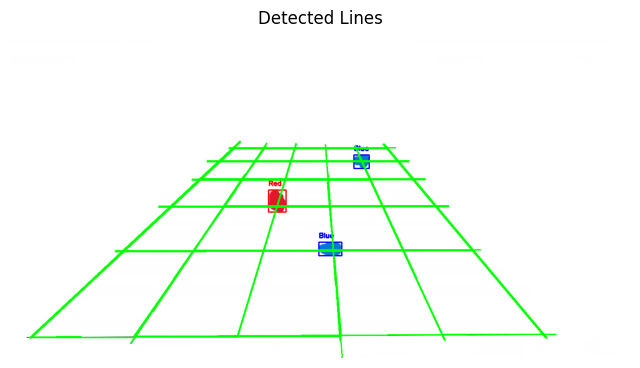
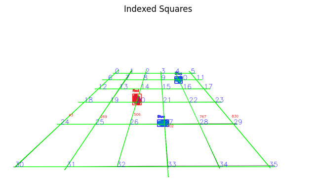

# One-Shot Object Localization and Path Planning

### By Adonay Gebremedhin

---

## Overview
This project focuses on object localization and path planning using an optimized search algorithm. The approach ensures efficient navigation while handling revisited paths in a structured manner.

---

## Algorithm
The path planning is based on A* (A-Star), a widely used algorithm for graph traversal and shortest path problems. It works as follows:

1. **Cost Tracking:** Maintains both the actual cost (`g_score`) from the start and an estimated total cost (`f_score`).
2. **Node Selection:** Prioritizes the node with the lowest `f_score`.
3. **Path Reconstruction:** Once the goal is reached, the route is traced back using stored parent nodes.
4. **Handling Revisited Paths:** If a path is revisited, an alternative rendering technique ensures clear visualization by slightly offsetting overlapping paths.

---

## Highlights

---

## Final Result
Given Drop off positions: drop_offs = {'Red': 17, 'Blue': 12}

**Computed Optimal Route:**  
`[35, 29, 28, 27, 21, 15, 14, 13, 12, 13, 14, 20, 14, 15, 16, 17, 11, 10, 9, 8, 7, 6, 12]`

This implementation ensures a balance between efficiency and clarity in path planning.
